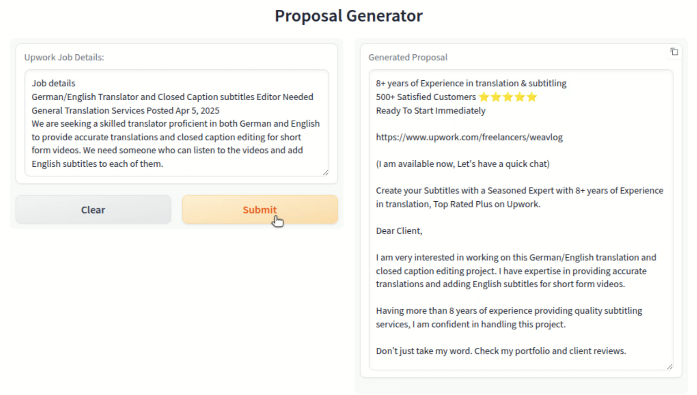

Below is an updated `README.md` pitch for your AI-powered Upwork proposal generator, incorporating the additional information that it runs fully free on Hugging Face and including the provided keywords for your custom AI automation services. The pitch maintains a formal tone, aligns with your response style preferences, and is crafted to attract Upwork freelancers while clearly presenting your bespoke services.

---

# AI-Powered Upwork Proposal Generator

## Elevate Your Freelancing Success on Upwork – Completely Free

Are you an Upwork freelancer looking to enhance your bidding strategy and secure more projects? The **AI-Powered Upwork Proposal Generator** is your key to crafting compelling, client-focused proposals that boost your response rate by up to 30%. Best of all, this tool is **fully free** to use, hosted seamlessly on Hugging Face for easy access without any setup or cost.

## Demo Video

Click the thumbnail below to open the demo video in a new tab: 

  

(if you are unable to view, click 'View raw' to download it: [[Job_proposal_generator_demo.mp4](https://github.com/bonsai89/AI_job_proposal_generator_upwork/blob/main/Upwork_job_proposal_generator_demo.mp4)])

### Why Choose This Tool?

Winning Upwork projects requires precision, speed, and an understanding of client psychology. This tool harnesses advanced AI, powered by cutting-edge language models, to analyze job postings and generate tailored proposals that resonate with clients. Here’s what makes it exceptional:

- **Client-Centric Proposals**: Automatically extracts key job requirements to create concise, keyword-optimized proposals that align with client needs.
- **Psychologically Crafted**: Designed to address client pain points and build trust, increasing the likelihood of a response.
- **Time-Saving Efficiency**: Generates professional proposals in minutes, freeing you to focus on delivering outstanding work.
- **Proven Results**: Engineered to improve response rates by up to 30%, giving you a competitive edge in the Upwork marketplace.
- **Niche-Specific Customization**: Tailored for freelancers specializing in subtitling, translation, transcription, and related fields, with adaptability for other expertise areas.
- **Completely Free Access**: Runs fully free on Hugging Face, requiring no subscriptions, API keys, or local setup.

### Key Features

- **Keyword Optimization**: Identifies and integrates critical job-specific keywords to ensure your proposal stands out.
- **Dynamic Proposal Structure**: Combines a personalized greeting, relevant experience highlights, and portfolio links for maximum impact.
- **Portfolio Integration**: Seamlessly incorporates samples of your previous work to showcase your credibility.
- **Intuitive Interface**: Powered by Gradio for a user-friendly experience, allowing you to input job details and receive polished proposals instantly.
- **Robust Performance**: Built with reliable AI processing to deliver consistent results, even for complex job postings.

### How It Works

1. **Access the Tool**: Visit the Hugging Face deployment link (provided below) to use the tool instantly—no installation required.
2. **Input Job Details**: Paste the Upwork job posting or relevant details into the interface.
3. **AI Analysis**: The system processes the job requirements, extracting keywords and determining the job type (e.g., translation, subtitling).
4. **Proposal Generation**: Produces a professional, client-tailored proposal complete with a personalized greeting and portfolio links.
5. **Review and Submit**: Copy the generated proposal, make any final adjustments, and submit it on Upwork.

### Who Is This For?

This tool is perfect for Upwork freelancers who:
- Specialize in subtitling, translation, transcription, or similar domains.
- Want to save time while submitting high-quality, strategic proposals.
- Seek to increase their response rates and win more projects.
- Prefer a free, accessible solution to enhance their bidding process without financial investment.

### Get Started Today

Transform your Upwork experience with the **AI-Powered Upwork Proposal Generator**. Hosted on Hugging Face, it’s free, fast, and ready to help you succeed. Whether you’re a seasoned freelancer or just starting out, this tool empowers you to bid smarter and connect with clients effortlessly.

**Ready to boost your response rate by 30%?** Click [here](#) to access the tool on Hugging Face and start generating winning proposals now.

---

### Hire Me for Custom AI Automation Solutions

Looking to take your freelancing or business processes to the next level? I offer **bespoke AI automation solutions** tailored to your unique needs. My expertise includes:

- **Web Scraping with Selenium**: Extract data efficiently and reliably.
- **n8n Workflows**: Automate complex processes with seamless integrations.
- **Proxy IP Rotation**: Ensure secure and scalable data collection.
- **API Integrations**: Connect tools and platforms for streamlined operations.
- **AI Agents**: Build intelligent systems to handle repetitive tasks.
- **RAG+ and LLM Prompt Engineering**: Optimize AI models for precision and performance.

I specialize in crafting tailored tools to optimize your workflows and meet your specific requirements. 

**Contact me on Telegram at https://t.me/bonsai_habibi** to discuss how I can build a custom solution for you.
